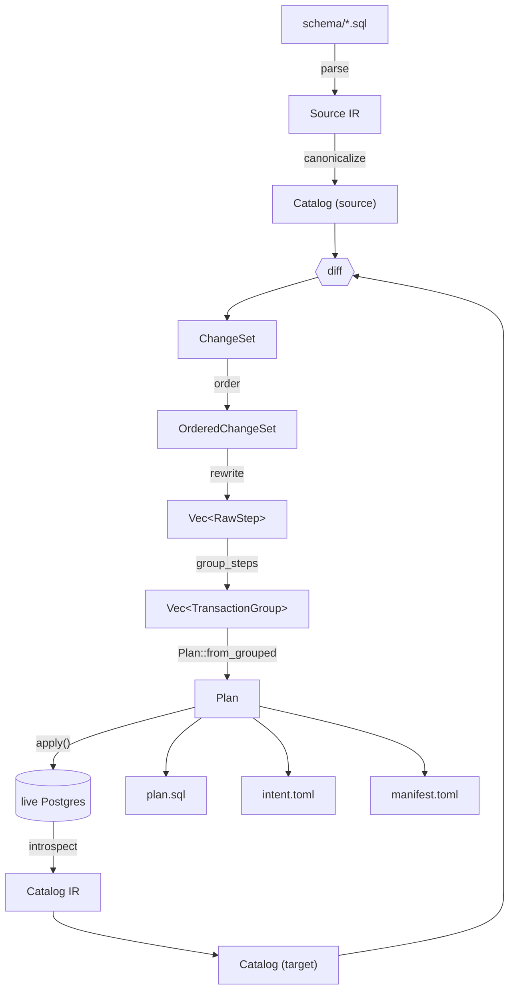

# Pipeline

The path from source SQL to applied DDL, phase by phase. Each phase has
its own implementation crate / module, status, and the design doc /
plan that drove it.

See [`../README.md`](./README.md) for the status legend.

## Phase summary

## Parsing (`pgevolve_core::parse`)

| Aspect | Status | Notes |
|---|---|---|
| `pg_query`-based statement classification | ✅ Implemented | Postgres's own parser, exposed via the `pg_query` crate. |
| Whitelist of source-side DDL kinds | ✅ Implemented | `CREATE SCHEMA/TABLE/INDEX/SEQUENCE`, `ALTER TABLE` (limited to FK whitelist), `COMMENT ON`. Everything else rejects with `UnsupportedObjectKind`. |
| Per-file `-- @pgevolve schema=<name>` directive | ✅ Implemented | Allows unqualified objects in a file to default to a named schema. |
| Per-object source location tracking | ✅ Implemented | Powers lint findings and round-trip cross-checks. |
| `parse_directory` and `parse_directory_with_locations` | ✅ Implemented | The first returns a `Catalog`; the second adds the `qname → SourceLocation` map for the linter. |
| Deterministic file order | ✅ Implemented | Walks paths in sort order so identical inputs produce identical output. |
| Multi-file project layout enforced by the layout profile | ✅ Implemented | See [`lint-and-layout.md`](./lint-and-layout.md). |

## AST canonicalization pass (`pgevolve_core::parse::ast_canon`)

Runs immediately after source parse, before the AST resolution pass. For each view and materialized view in the provisional catalog, the pass:

1. Calls `NormalizedBody::from_sql` (see `parse/normalize_body.rs`) on `raw_body` to fill `body_canonical`.
2. Walks the body AST to extract `DepEdge` records with `DepSource::AstExtracted` provenance, filling `body_dependencies`.
3. Resolves each referenced relation against the provisional catalog. Unresolved references surface as `AstCanonError::UnresolvedReference`.
4. Fills `columns` from the SELECT target list when no explicit alias list was provided (using Postgres's column-naming algorithm: explicit alias → rightmost `ColumnRef` name → `"?column?"` fallback).

The same `NormalizedBody::from_sql` call is used on the catalog side (T5 reader queries `pg_get_viewdef`), so source-side and catalog-side canonical texts are directly comparable by the differ. The v0.2 property test (`view_canonicalization_closed_under_pg_rewrite`) verifies this closure invariant.

| Aspect | Status | Notes |
|---|---|---|
| `NormalizedBody::from_sql` canonicalization | ✅ Implemented | `pg_query` parse + deparse + redundant-qualifier strip (`SELECT users.id FROM app.users` → `SELECT id FROM app.users` for single-relation `FROM` clauses, so PG14's qualified `pg_get_viewdef` output matches PG17's unqualified form) + whitespace collapse. Source: `parse/normalize_body.rs`. |
| Dep-edge extraction from view body AST | ✅ Implemented | `DepEdge { from: NodeId::View, to: NodeId::Table/View/Mv, source: AstExtracted }`. |
| `body_dependencies` integration into planner ordering | ✅ Implemented | View → table and view → view edges are part of the dep-graph; creates and drops respect the topo order. |

## AST resolution pass (`pgevolve_core::parse::resolve`)

Runs after the AST canonicalization pass. Validates structural references before diff.

| Aspect | Status | Notes |
|---|---|---|
| FK targets validated against declared tables | ✅ Implemented | Surfaces unresolved references as `ParseError::AstResolution` with source location. |
| Default-using sequences validated against declared sequences | ✅ Implemented | Same error path. |
| View body cross-references validated against declared objects | ✅ Implemented | The AST canon pass (`ast_canon.rs`) surfaces unresolved view body references as `AstCanonError::UnresolvedReference`. |

## Catalog reader (`pgevolve_core::catalog`)

| Aspect | Status | Notes |
|---|---|---|
| Version detection (`pg_control_system`, server_version_num) | ✅ Implemented | PG 14/15/16/17 tested per major. |
| Per-version SQL strings for each catalog query | ✅ Implemented | |
| Schemas, tables, columns, constraints, indexes, sequences | ✅ Implemented | Mirrors the v0.1 IR surface. |
| Dependencies (sequence `OWNED BY`, default → sequence) | ✅ Implemented | |
| `pg_catalog.default` collation normalized to "none" | ✅ Implemented | Avoids phantom drift on every text column. |
| Sequence type-default min/max normalized to "unspecified" | ✅ Implemented | Same reason — PG stores explicit values even when the user didn't specify them. `Catalog::canonicalize` applies the same normalization on the source side, so a hand-written `MINVALUE 1` (bigint default) round-trips equal to a catalog read that returns `None`. |
| Views and materialized views | ✅ Implemented | `read_views` and `read_materialized_views` query `pg_views` / `pg_matviews`, call `pg_get_viewdef` for the body text, and feed it through `NormalizedBody::from_sql` so the catalog-side canonical text is directly comparable with the source-side canonical text. |
| Object kinds beyond v0.1/v0.2 views (functions, triggers, types, …) | 📋 Planned, v0.2+ | Lands with the corresponding object-kind support. |
| Catalog filtering by `[managed]` schemas + `[managed].ignore_objects` globs | ✅ Implemented | Unmanaged schemas don't appear in the IR at all. |
| Catalog drift detection — returns `(Catalog, DriftReport)` | ✅ Implemented | See "Catalog drift detection" section below. |

## Catalog drift detection

The catalog reader returns a `DriftReport` alongside the `Catalog`. The differ and planner consume it to automatically recover from partial-apply states.

| Drift kind | Detection | Diff emit | Planner emit | Status |
|---|---|---|---|---|
| NOT VALID constraints (`pg_constraint.convalidated = false`) | Catalog reader | `Change::ValidateConstraint` | `ALTER TABLE ... VALIDATE CONSTRAINT` | ✅ Implemented |
| INVALID indexes (`pg_index.indisvalid = false`) | Catalog reader | `Change::RecreateIndex` | `DROP INDEX + CREATE INDEX` | ✅ Implemented |

Both drift kinds are auto-recovery paths — the user doesn't author NOT VALID or INVALID states; pgevolve detects and resolves them. This covers recovery from crashed FK NOT VALID + VALIDATE rewrites and failed `CREATE INDEX CONCURRENTLY`.

## Differ (`pgevolve_core::diff`)

| Aspect | Status | Notes |
|---|---|---|
| `Catalog::diff` produces a structured `Vec<Difference>` for assertions | ✅ Implemented | |
| `diff(target, source) → ChangeSet` produces the unordered planner input | ✅ Implemented | Each `ChangeEntry` carries a `Destructiveness` classification. |
| Pair-by-qname semantics | ✅ Implemented | Tables / indexes / sequences pair by qualified name; columns / constraints pair by bare name within their parent table. |
| Column reorder detection | 🟡 Partial | Detected as `columns.<order>` difference but the planner does not yet emit a reorder step (Postgres has no `ALTER COLUMN ... POSITION`, so this would require table rewrite). |
| Index option change detection | ✅ Implemented | Triggers `ReplaceIndex` (drop + create). |
| Constraint rename detection | ⛔ Not planned | Diffs as drop+add. |
| Destructiveness classification | ✅ Implemented | Three levels: `Safe`, `RequiresApproval`, `RequiresApprovalAndDataLossWarning`. |

## Planner (`pgevolve_core::plan`)

### Ordering

| Aspect | Status | Notes |
|---|---|---|
| Three-phase ordering: creates → modifies → drops | ✅ Implemented | Each phase topologically sorted by the appropriate graph. |
| Source-side dependency graph for creates / modifies | ✅ Implemented | Schema ← table, table ← index, FK ← both endpoints, sequence ← owning table, table ← default-using sequence. |
| Target-side dependency graph for drops | ✅ Implemented | Same edges; drop order is the reverse topo sort. |
| FK forward-reference cycle handling | ✅ Implemented | Cycles are broken by extracting offending FKs into a post-pass `DeferredFkAdd` list. |
| Deterministic tie-break | ✅ Implemented | Topological sort uses a `BTreeSet`/min-heap by `Ord`; identical inputs produce byte-identical plans. |

### Rewrites

| Rule | Status | Notes |
|---|---|---|
| Concurrent index create (`CREATE INDEX CONCURRENTLY`) on existing tables | ✅ Implemented | Non-unique only. Excluded for new tables, unique indexes, and atomic policy. |
| Concurrent index drop (`DROP INDEX CONCURRENTLY`) on existing non-unique indexes | ✅ Implemented | Same gating. |
| FK `NOT VALID` + `VALIDATE CONSTRAINT` for adds on existing tables | ✅ Implemented | Splits across two transaction groups so step A (cheap) commits before step B (table scan). |
| CHECK `NOT VALID` + `VALIDATE CONSTRAINT` for adds on existing tables | ✅ Implemented | Same pattern as FK. |
| `SET NOT NULL` on populated columns via the CHECK pattern (4 steps) | ✅ Implemented | `ADD CHECK NOT VALID` → `VALIDATE` → `SET NOT NULL` (cheap once validated) → `DROP CONSTRAINT`. |
| Per-environment policy override (`[environments.<env>].strategy = "atomic"`) | ✅ Implemented | Atomic mode disables every online rewrite. |
| `REFRESH MATERIALIZED VIEW CONCURRENTLY` upgrade | ✅ Implemented | When `refresh_mv_concurrently = true` (default) and the MV has a unique index, the planner emits `REFRESH MATERIALIZED VIEW CONCURRENTLY` instead of the locking variant. Gated on strategy = online. |
| Dependent-view recreation cascade (`recreate_views::extend_with_dependent_recreations`) | ✅ Implemented | When a table drop, column change, or incompatible view-body replace is detected, the planner walks `body_dependencies` transitively and emits explicit `DROP + CREATE` steps for every affected view. Controlled by `view_drop_create_dependents` switch (default `true`). |
| `ALTER TYPE ... ADD VALUE` (enum value add) online rewrite | 📋 Planned, v0.2 | Lands with enum support. |
| `ALTER COLUMN ... TYPE` online rewrite (e.g., int → bigint) | 🔮 Future | Currently emits a single `ALTER COLUMN ... TYPE` step, which can rewrite the entire table. The "USING expr + new column + rename" pattern is a candidate v0.3 rewrite. |
| `REINDEX CONCURRENTLY` for bloated indexes | 🔮 Future | Not currently emitted by the planner; users invoke manually. |

### Plan-time lint gate

| Aspect | Status | Notes |
|---|---|---|
| `run_drift_lints` called after diff, before writing plan | ✅ Implemented | Any `LintAtPlan` finding without a matching `[[lint_waiver]]` in `intent.toml` causes `pgevolve plan` to exit with code 2. |
| `column-position-drift` as a `LintAtPlan` finding | ✅ Implemented | See [`lint-and-layout.md`](./lint-and-layout.md). |

### Step grouping

| Aspect | Status | Notes |
|---|---|---|
| Adjacent steps with the same `TransactionConstraint` coalesce into one group | ✅ Implemented | |
| Transactional groups run inside one `BEGIN; … COMMIT;` | ✅ Implemented | |
| Non-transactional groups run as autocommit singletons | ✅ Implemented | Each `CONCURRENTLY` step is its own atomic unit. |

## Plan format (`pgevolve_core::plan::{serialize, deserialize}`)

| File | Status | Notes |
|---|---|---|
| `plan.sql` | ✅ Implemented | Canonical artifact: directive header + per-group BEGIN/COMMIT + per-step `-- @pgevolve step=…` directive lines + SQL bodies. Runs cleanly under `psql -f` even without pgevolve's executor. |
| `intent.toml` | ✅ Implemented | One `[[intent]]` row per destructive step; user must flip `approved = true` before applying. |
| `manifest.toml` | ✅ Implemented | Plan id (full hex), version metadata, target identity, embedded pre-image catalog as JSON. |
| Round-trip property: `read_plan_dir(write_plan_dir(p)) == p` | ✅ Implemented | Property-tested. |
| Cross-file plan-id mismatch detection | ✅ Implemented | All three files must agree on `plan_id`. |
| Deterministic `PlanId` (BLAKE3 over bincode-encoded `(source, target, version, ruleset)`) | ✅ Implemented | Identical inputs always produce the same id. |

## Executor (`pgevolve::executor`)

| Stage | Status | Notes |
|---|---|---|
| Bootstrap `pgevolve.bootstrap_version` / `apply_log` / `plan_steps` / `lock` tables | ✅ Implemented | Idempotent; append-only migration list. |
| Singleton advisory lock (`pg_try_advisory_lock`) | ✅ Implemented | Lock key derived from ASCII `PGEVOLVE`. Session-scoped; released on disconnect or via `release_lock`. |
| Target-identity computation (BLAKE3 of `(db, host, port, cluster_name, system_identifier)`) | ✅ Implemented | |
| Preflight: identity match | ✅ Implemented | Bypassed only with `--allow-different-target`. |
| Preflight: drift recheck | 🟡 Partial | The plan slot exists but the executor's drift check is stubbed; the CLI's `apply` currently forces `allow_drift = true`. Phase-9 follow-up. |
| Preflight: intent approval enforcement | 🟡 Partial | The plan's `intents` field is loaded but the executor doesn't re-check `approved = true` from disk. Phase-9 follow-up. |
| Preflight: `[[lint_waiver]]` structural validation | ✅ Implemented | Preflight validates that every `[[lint_waiver]]` row has non-empty `rule` and `target`. Documented limitation: does not re-run drift lints at apply time (source not available); the live-catalog recheck stub will land in a future task. |
| Audit row writes (`open_apply_log`, `mark_step_*`, `close_apply_log`) | ✅ Implemented | |
| Transactional group execution (single `BEGIN…COMMIT`) | ✅ Implemented | A step failure rolls back the group; every step in the group ends up `failed` (the offender) or `rolled_back` (the rest). |
| Autocommit group execution | ✅ Implemented | Stops on first failure; earlier steps stay `succeeded`. |
| `abort_after_step` testkit hook (chaos harness) | ✅ Implemented | Cleanly aborts after a named step; the apply_log row goes to `aborted`. |
| Real `SIGKILL`-mid-apply chaos | 🔮 Future | The clean-abort path covers recovery semantics; literal SIGKILL is more invasive and reserved for v0.2's chaos coverage. |

## Shadow validation (`pgevolve validate --shadow`)

| Aspect | Status | Notes |
|---|---|---|
| Ephemeral Postgres per configured major version | ✅ Implemented | testcontainers-backed; the IR is applied via the same planner + executor pipeline. |
| Round-trip introspection + diff | ✅ Implemented | Mismatches are reported as line-by-line `Finding`s on stderr. |
| `--shadow` without Docker | ✅ Implemented | Exits with a clear error rather than crashing inside testcontainers. |
