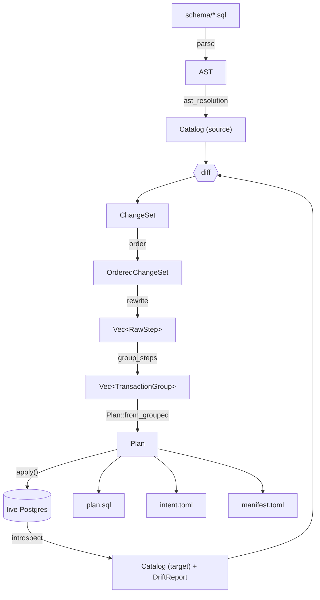

# Architecture

A guided tour of pgevolve's internals: the crates, the data flow, the
key invariants, and the design decisions that shaped each.

## TL;DR

pgevolve is built on a **declarative IR**. Source SQL and live-database
introspection both fold into the same `Catalog` type; the planner
computes the difference; the executor applies the difference under
strict transactional and audit guarantees.



Every box and arrow is a module-level boundary. Sections below walk each.

## Crate layout

```
crates/
├── pgevolve-core/         I/O-free library: IR, parser, diff, planner, plan format, lint
├── pgevolve-core-macros/  Proc-macro crate: `#[derive(DiffMacro)]` for IR `Diff` impls
├── pgevolve/              CLI binary + library API (the only crate that depends on tokio_postgres)
├── pgevolve-testkit/      Internal-only test infra (publish = false)
└── xtask/                 `cargo xtask bless` for regenerating goldens
```

### `pgevolve-core` — the brain

| Module | Responsibility |
|---|---|
| `identifier` | `Identifier` (single SQL name) and `QualifiedName` (`schema.name`). Quoting / validation. |
| `ir/` | The data model. `Catalog`, `Schema`, `Table`, `Column`, `Index`, `Sequence`, `Constraint`, plus user types, functions, procedures, views, MVs, `ColumnType` (canonical type form), `DefaultExpr`, `NormalizedExpr`, `NormalizedBody`. Most IR structs derive their `Diff` impl via `#[derive(DiffMacro)]`. |
| `ir/canon/` | The single canonicalization pipeline. Four ordered passes (`filter_pg_defaults`, `sentinel_view_columns`, `renumber_enum_sort_orders`, `sort_and_dedupe`) that run on both source-built and catalog-read `Catalog`s. `Catalog::canonicalize` is a thin wrapper. |
| `parse/` | Source-side SQL → IR. Wraps `pg_query`. Includes `ast_resolution` (post-parse structural validation), `ast_canon` (view-body canonicalization + MV index parent promotion), and `normalize_body` (statement-scope canonicalizer with cross-PG-version qualifier stripping). |
| `catalog/` | Live-PG → IR. Defines `CatalogQuerier` (sync trait) and the per-version SQL strings; returns `(Catalog, DriftReport)` capturing NOT VALID constraints and INVALID indexes. Catalog reader produces raw IR values; PG-default elision lives in `ir/canon/`. The actual `tokio_postgres` adapter lives in the binary. |
| `diff/` | `Catalog × Catalog → ChangeSet`. Pair-by-qname semantics; destructiveness classification. Includes `Change::ValidateConstraint` and `Change::RecreateIndex` for drift recovery. |
| `plan/` | The planner: order → rewrite → group → write/read. Plan format and `PlanId` hashing. `plan::edges` holds `DepEdge` / `DepSource` for typed dep provenance. |
| `lint/` | Universal rules + four built-in layout profiles + custom-profile regex+assertion mechanism. Includes `Severity::LintAtPlan` tier and `column-position-drift` rule. |

**Invariant:** `pgevolve-core` does no I/O at the type level. The only
filesystem walk is `parse::parse_directory`, which is the explicit
entry point. Everything else is library-style data manipulation.

### `pgevolve` — the binary and the runtime

| Module | Responsibility |
|---|---|
| `api/` | Library entry points for embedding pgevolve in other tools and tests. `build_plan(schema_dir, client, opts) -> Plan` runs the full parse→introspect→diff→order→rewrite→group pipeline without CLI ceremony. |
| `cli` | clap subcommand definitions. |
| `commands/` | One file per subcommand. `init`, `lint`, `validate`, `diff`, `plan`, `apply`, `status`, `bootstrap`, `dump` (stub), `graph`, `doctor`, `rewrite_table` (skeleton). The `plan` command is a thin shim over `api::build_plan`; `apply` is a thin shim over `executor::apply_plan`. |
| `config` | `pgevolve.toml` loader + validation. Includes `[shadow]` block with `backend` / `url` / `extensions` fields. |
| `connection` | DSN resolution (CLI > env.url > env.url_env > `PGEVOLVE_DATABASE_URL` > libpq env). |
| `executor/` | The apply loop: bootstrap, lock, target-identity, preflight (checks `[[lint_waiver]]` well-formedness), audit, execute, status. Exposes `apply(plan_dir, ...)` and `apply_plan(&Plan, ...)` as library entry points. |
| `pg_querier` | `tokio_postgres`-backed `CatalogQuerier`. Mirrors the testkit one to avoid pulling `testcontainers` into the binary. |
| `shadow/` | `ShadowBackend` trait + `testcontainers` and `dsn` impls. Backend selected via `[shadow].backend` in `pgevolve.toml`. Replaces the old `shadow_pg.rs` module. |
| `target_identity` | BLAKE3 hash of `(current_database, host, port, cluster_name, system_identifier)`. |

### `pgevolve-testkit` — internal-only test infra

Holds `EphemeralPostgres` (testcontainers wrapper), `PgCatalogQuerier`
(the same adapter the binary uses, exposed for tier-3 tests), the
`MigrationFixture` loader, the IR generator + mutator, and the
`assert_canonical_eq` helper. Not published; `publish = false` in
`Cargo.toml`.

### `xtask` — workspace-local tooling

A binary invoked via `cargo xtask <subcommand>`. Currently only
`bless`, which regenerates tier-3 catalog goldens by running the
fixtures against ephemeral containers and writing canonical JSON.

## Data flow, in more detail

### Parse → IR (source)

`parse_directory(root, ignores)`:

1. Walks `root` in sorted order, picking up `*.sql` files.
2. Runs `pg_query::parse` on each file.
3. Classifies every top-level statement against the v0.1 whitelist
   (`CREATE SCHEMA / TABLE / INDEX / SEQUENCE`, the FK-whitelist
   `ALTER TABLE`, `COMMENT ON`).
4. Builds an IR object per statement.
5. Tracks every object's `SourceLocation` for the linter.
6. **AST resolution pass** (`parse::ast_resolution`): runs between
   parse and canonicalize; validates structural references (FKs,
   default sequences) and surfaces source-located errors. v0.1 uses
   structural edges only; v0.2 view/function sub-specs will add
   `AstExtracted` and `AstDeclared` provenance.
7. Calls `Catalog::canonicalize` at the end (sorts collections, rejects
   duplicate qnames).

Output: a `Catalog`. Optionally, with
`parse_directory_with_locations`, a `(Catalog, HashMap<String,
SourceLocation>)` for the linter.

### Introspect → IR (target)

`pgevolve_core::catalog::read_catalog(querier, filter)`:

1. Detects the server version (PG 14/15/16/17).
2. For each `CatalogQuery` kind (Schemas, Tables, Columns, etc.) picks
   the per-version SQL string and runs it via the querier.
3. Decodes rows into typed `Value`s, including `convalidated` (NOT
   VALID constraints) and `indisvalid` (INVALID indexes).
4. Assembles a `Catalog` and canonicalizes.
5. Returns a `DriftReport` alongside the `Catalog` capturing NOT VALID
   constraints (`Change::ValidateConstraint`) and INVALID indexes
   (`Change::RecreateIndex`). These recover automatically from
   partial-apply states.

The `CatalogQuerier` is a synchronous trait — the binary's
`PgCatalogQuerier` bridges to async `tokio_postgres` via
`block_in_place`. This keeps `pgevolve-core` runtime-agnostic.

### Diff

`pgevolve_core::diff::diff(target, source) → ChangeSet`:

- Tables, indexes, sequences pair by qualified name.
- Columns and constraints inside a table pair by bare name.
- Each `ChangeEntry` carries a `Destructiveness` tag: `Safe`,
  `RequiresApproval`, or `RequiresApprovalAndDataLossWarning`.

### Planner: order

`pgevolve_core::plan::order(target, source, changes) →
OrderedChangeSet`. Three buckets:

1. **Creates and additive ops** — topo-sorted via the source-side
   dependency graph.
2. **Modify-in-place** — same graph (column-type changes, constraint
   replacements).
3. **Drops** — reverse-topo-sorted via the target-side graph.

The dependency graph has these edge sources (spec §6.4):

- `schema ← table ← column-default-using-sequence`
- `table ← index`
- `FK constraint ← both endpoints`
- `sequence ← owning table (OWNED BY)`

FK cycles (chicken-and-egg between two tables) are broken by
**extracting** offending FKs into a post-pass `DeferredFkAdd` list and
re-running the topo sort. The deferred FKs become `ALTER TABLE ADD
CONSTRAINT` steps after both tables are created.

### Planner: rewrite

`pgevolve_core::plan::rewrite(ordered, target, policy) → Vec<RawStep>`.
Each change becomes one or more `RawStep`s. Four documented online
rewrites (gated by `PlannerPolicy`):

1. **Concurrent index** — `CREATE INDEX CONCURRENTLY` for non-unique
   indexes on existing tables. Runs in its own non-transactional
   group.
2. **FK NOT VALID + VALIDATE** — Adding an FK on an existing table
   splits into two steps in two transaction groups.
3. **CHECK NOT VALID + VALIDATE** — Same shape for CHECK constraints.
4. **SET NOT NULL via CHECK pattern** — Four-step pattern that avoids
   the long `ACCESS EXCLUSIVE` of a naive `SET NOT NULL`.

`Strategy::Atomic` short-circuits every rewrite — one big transaction,
no online tricks. Useful for hermetic dev / test environments.

### Planner: group

`group_steps(steps) → Vec<TransactionGroup>` coalesces adjacent steps
with the same `TransactionConstraint`. Each transactional group runs
inside one `BEGIN; … COMMIT;`. Non-transactional groups host
`CONCURRENTLY` operations (autocommit singletons).

### Plan format

`Plan::from_grouped` assigns 1-indexed step numbers, allocates an
`intent_id` per destructive step, and computes the `PlanId`.

**`PlanId` derivation** (`pgevolve_core::plan::plan::PlanId::compute`):

```
BLAKE3(
    "pgevolve-plan-id-v1\n"
    || pgevolve_version || 0x00
    || planner_ruleset_version (big-endian u32) || 0x00
    || bincode(source_catalog) || 0x00
    || bincode(target_catalog)
)
```

Bincode is used because its encoding is deterministic across runs and
machines. Identical inputs produce identical bytes; the hash is the
identity. `serde_json` was rejected here because float / map orderings
aren't byte-deterministic across versions.

**Three-file on-disk format:**

- `plan.sql` — canonical artifact. Runs cleanly under `psql -f`.
  Directive comments (`-- @pgevolve ...`) carry the structured data the
  executor needs.
- `intent.toml` — destructive intents, `approved = false` by default.
- `manifest.toml` — plan id (full hex), version metadata, target
  identity, embedded pre-image catalog as JSON.

### Executor

`pgevolve::executor::apply(plan_dir, client, filter, overrides)`:

1. `read_plan_dir` — load the three files; cross-check the plan id.
2. `bootstrap_metadata` — idempotent install of `pgevolve.*` tables.
3. `try_acquire_lock` — `pg_try_advisory_lock(PGEVOLVE_LOCK_KEY)`.
4. `run_preflight` — target-identity check, drift recheck, intent
   approval check.
5. `open_apply_log` — insert `apply_log` row (status `running`),
   pre-populate `plan_steps` as `pending`.
6. `execute_plan` — per-group transactional or autocommit execution;
   audit each step's transition.
7. `close_apply_log` — set status `succeeded` / `failed` / `aborted`.
8. `release_lock` — clear the lock row + advisory unlock.

### v0.2 readiness additions

The following types and modules were added as foundation for v0.2
sub-specs (views, functions, types, etc.). They are live in the codebase
but v0.1 does not yet produce the richer variants.

**`DepEdge` / `DepSource`** (`pgevolve-core::plan::edges`): dependency
edges in the planner graph are now first-class typed values. `DepSource`
carries provenance:
- `Structural` — v0.1 edge sources (FK endpoints, sequence ownership,
  index-to-table, etc.).
- `AstExtracted` — will be emitted by the AST resolution pass once v0.2
  view/function body parsing lands.
- `AstDeclared` — will be emitted when a `-- @pgevolve dep:` directive
  is present in source SQL.

**`NormalizedBody`** (`pgevolve-core::parse::normalize_body`): a
statement-scope canonicalizer paralleling `NormalizedExpr`. v0.2 body-
bearing objects (views, materialized views, functions, procedures) all
canonicalize through it. Includes a cross-PG-version pass that strips
redundant table qualifiers from column refs in single-relation
`SELECT` bodies — PG14's `pg_get_viewdef` keeps the qualifier while
PG17 strips it; this pass aligns the two.

**`DriftReport`**: returned alongside `Catalog` from `read_catalog`.
Contains NOT VALID constraints and INVALID indexes that may be present in
a database after an interrupted apply. `pgevolve doctor` surfaces these;
`pgevolve plan` emits `Change::ValidateConstraint` /
`Change::RecreateIndex` steps to resolve them.

**`Severity::LintAtPlan`**: a new lint severity tier between `Warning`
and `Error`. Plan-time gate: `pgevolve plan` exits `2` on any unwaived
`LintAtPlan` finding. The first rule at this severity is
`column-position-drift`. Waive via `[[lint_waiver]]` in `intent.toml`.

**`PlanError::BodyCycle` / `PlanError::AstResolution`**: new error
variants in the planner. v0.1 does not produce them; they exist as typed
seams so v0.2 body-bearing objects have a home to fail into.

**CLI additions**: `graph` (dep graph render), `doctor` (health check),
`rewrite-table` (skeleton; errors "not yet implemented"),
`--shadow-validate` / `--shadow-strict` flags on `plan` / `diff` /
`validate`.

## v0.3: cross-cutting state

v0.3 ships the **cross-cutting state** series. Where v0.2 added new
object *kinds* (views, types, functions, triggers, partitions), v0.3
adds new *state dimensions* that attach to existing IR objects:

| Release | Adds (per-object field) | Reaches |
|---|---|---|
| v0.3.0 | cluster surface: `ClusterCatalog`, `Role`, `RoleAttributes` | `pgevolve cluster …` subcommands |
| v0.3.1 | `owner: Option<Identifier>` + `grants: Vec<Grant>` | Schema, Table, View, MV, Sequence, Function, Procedure, UserType |
| v0.3.2 | `rls_enabled: bool`, `rls_forced: bool`, `policies: Vec<Policy>` | Table |
| v0.3.3 | `storage: *StorageOptions` (typed fields + `extra: BTreeMap`) | Table, Index, MaterializedView |

All four sub-specs share a common design pattern:

1. **Typed `Option<T>` fields, not bare booleans or strings.** Closed
   sets become enums; open sets get a typed field plus an `extra:
   BTreeMap<String, String>` escape hatch (reloptions). Numeric f64
   fields wrap a `NotNanF64` newtype so they participate in `Eq`/`Hash`/`Ord`.
2. **Lenient drift.** Source `None` means *"this attribute is
   unmanaged"* and the differ produces no `Reset*` / `Revoke*` /
   `DropPolicy` change. Removing a value from source therefore never
   causes a destructive ALTER on the catalog side. To clear a managed
   value, the operator issues the `RESET` / `REVOKE` out-of-band; the
   next plan run sees both sides as `None` and the diff is empty.
3. **Per-feature `unmanaged-*` lints.** Because the differ never resets
   on its own, each sub-spec ships a lint that surfaces catalog values
   not declared in source: `unmanaged-grant`, `unmanaged-policy`,
   `unmanaged-reloption`. All warnings, waivable via
   `[[lint_waiver]]` in `intent.toml`.
4. **One `Set*` `Change` variant per dimension.** No paired `Reset*`
   variant — the lenient policy makes the reset path unreachable.
   The differ emits a *sparse delta*: only the fields where source is
   `Some(_)` AND target disagrees flow into the change.

### Known limitation: new objects don't carry cross-cutting state inline

When the differ encounters an object in source that the target catalog
doesn't have, it emits a single `Change::CreateTable` / `CreateIndex` /
`CreateMaterializedView` step. The corresponding renderer (`sql::create_table`,
`sql::create_index`, etc.) emits the bare `CREATE … (…)` statement —
**without** the `WITH (…)` reloption clause, without `ALTER … OWNER TO`,
without inline `GRANT`s or `CREATE POLICY` companions, and without
`ENABLE ROW LEVEL SECURITY`.

The state lands on the **second** plan run: after apply, the catalog
reader sees the new object with PG-default attributes, the differ
notices source declares non-default values, and emits the appropriate
`AlterObjectOwner` / `GrantObjectPrivilege` / `CreatePolicy` /
`SetTableStorage` steps. Convergent in two plan iterations.

A uniform fix — emitting cross-cutting state inline at object creation
or in companion steps adjacent to the `Create*` — is tracked for a
future v0.3.x maintenance release. Until then, operators authoring
brand-new objects with cross-cutting state should expect to run
`pgevolve plan` and `pgevolve apply` twice to fully converge.

## The canonicalization pipeline

Both the source parser and the catalog reader produce `Catalog` values
that may carry IR fields PG fills in implicitly (sequence min/max,
function cost/rows, `pg_catalog.default` collations, fractional enum
sort orders, redundant view-column type info). For source and catalog
to compare equal, both sides must run an identical canonicalization
pass.

`Catalog::canonicalize` is a thin wrapper around `ir::canon::canonicalize`
which runs four ordered passes, in this order:

1. **`filter_pg_defaults`** — values equal to PG's documented defaults
   become `None` (sequence min/max, function cost/rows, column
   `pg_catalog.default` collation).
2. **`sentinel_view_columns`** — view/MV column types collapse to a
   shared `view_column` sentinel. Body changes are captured by
   `body_canonical` (an AST hash); per-output-column types are
   redundant and unresolvable from source statically.
3. **`renumber_enum_sort_orders`** — each enum's `sort_order` values
   are re-indexed to `1.0, 2.0, 3.0, …` in current order.
4. **`sort_and_dedupe`** — every IR collection is sorted by its
   canonical key and duplicates raise `IrError`. Runs last so duplicate
   detection sees post-normalization values.

When PG returns a default we hadn't expected, the fix lands in one of
those four passes. Catalog readers and source builders are kept "raw"
— they never filter — so the rule is discoverable in one place.

## Library API for embedding pgevolve

`pgevolve` exposes a small library surface for tools and tests that
need to run plan/apply in-process rather than spawning the binary:

- `pgevolve::api::build_plan(schema_dir, client, opts) -> Plan`
  consumes a `tokio_postgres::Client`, runs the full
  parse→introspect→diff→order→rewrite→group pipeline, and returns a
  `Plan` value. No `println!`, no waiver-prompt UX, no
  `--shadow-validate`, no on-disk plan directory.
- `pgevolve::executor::apply_plan(&Plan, &mut client, &filter, overrides)`
  applies an in-memory `Plan`. The disk-based `executor::apply(path,
  &mut client, ...)` is a thin shim that calls `read_plan_dir` then
  delegates to `apply_plan`.
- `Plan::approve_all_intents()` (on `pgevolve_core::plan::Plan`) marks
  every destructive intent as approved. For test harnesses that build
  plans programmatically; production apply still requires
  `intent.toml`-based approval.

The conformance suite uses these entry points exclusively — it spawns
no subprocesses. The CLI commands (`pgevolve plan`, `pgevolve apply`)
are themselves thin wrappers over these library entry points plus
CLI-only UX (printing, exit codes).

## Key invariants

These are testable, must-hold-or-the-build-breaks properties.

1. **`Catalog::diff` is byte-deterministic.** Identical IRs produce an
   empty diff. Two different IRs always produce the same diff.
2. **`PlanId::compute` is byte-deterministic.** Same inputs ⇒ same id,
   on any machine.
3. **`write_plan_dir` then `read_plan_dir` round-trips** (modulo
   destructive_reason, which is grafted from `intent.toml`).
4. **Topological order is deterministic.** Ties broken by the smallest
   node per `Ord`; the planner's output is byte-stable.
5. **No I/O in `pgevolve-core` at the type level.** The only fs walk is
   the explicit `parse_directory`.
6. **The advisory lock is singleton.** `try_acquire_lock` succeeds for
   at most one session at a time. Property-tested.
7. **No partial success.** Apply either succeeds end-to-end or reports
   the exact failed step in `pgevolve.plan_steps`.
8. **No silent data loss.** Destructive steps require approved
   intents; pre-flight refuses to run with `approved = false`.

## Design decisions worth knowing

### Why an IR (and not just diff SQL text)?

Postgres has many ways to write the same thing: `'foo'::text` vs
`'foo'`, `NUMERIC` vs `NUMERIC(38, 0)`, `int4` vs `integer`. A
text-level diff would noise-trip on every cosmetic difference. The IR
canonicalizes — paren folding, keyword case, type aliases, etc. — so
that semantically-equal inputs produce equal `Catalog` values.

### Why three files in a plan directory (vs. one)?

- `plan.sql` is the **review artifact**. Reviewers read SQL.
- `intent.toml` is the **approval artifact**. The diff in a PR for
  `intent.toml` is the exact destructive change being authorized.
- `manifest.toml` is the **integrity artifact**. The embedded pre-image
  + full hex hash + plan-id cross-check means the executor can refuse
  to run a tampered plan.

Splitting these means the right people review the right surface.

### Why three-phase ordering (vs. one topological sort)?

Drops have to run in **reverse** of creates. Modify ops can reference
either pre- or post-image. Splitting into three buckets with two
graphs (source for creates/modifies, target for drops) is the
smallest model that handles every case correctly.

### Why FK-cycle extraction (vs. deferred constraints or topological-sort failures)?

Inline FKs in `CREATE TABLE` create chicken-and-egg cycles when two
tables FK each other. Postgres supports `DEFERRABLE` constraints, but
that's a runtime semantics shift and not all FKs are deferrable.
Extracting the offending FKs into `ALTER TABLE ADD CONSTRAINT` after
both tables exist is the surgical fix.

### Why `bincode` for `PlanId`?

The hash payload doesn't need to be human-readable. Bincode is binary,
deterministic, and several times faster than the alternatives.
**Note:** pinned to v2 because v3 dropped the serde feature.

### Why does `pgevolve-core` not depend on `tokio_postgres`?

Keeps the library testable without a running runtime, and makes it
plausible to add other backends (file-based, raw libpq, etc.) without
restructuring. The `CatalogQuerier` trait is the integration point;
the binary's `pg_querier` is the only impl today.

### Why are advisory locks session-scoped, not transaction-scoped?

Apply spans multiple transactions (e.g., one transactional group + one
autocommit group). A transaction-scoped lock would release between
groups; a session-scoped one stays held for the whole apply.

### Why does `validate --shadow` re-implement parts of `apply`?

Because it has to apply the source IR to a fresh database from
scratch, with `target_identity` set to the live shadow's identity (not
whatever was in the source `pgevolve.toml`). It builds a plan
in-memory and writes to a tempdir, then calls the same `executor::apply`
the regular `apply` command uses.

## Where each invariant is tested

| Invariant | Test |
|---|---|
| Diff determinism | Tier 1 unit tests in `diff/` + tier 5 property test `plan_id_is_deterministic` (which transitively requires diff determinism). |
| `PlanId` determinism | `plan_id_is_deterministic` property test. |
| Plan round-trip | `read_plan_dir_round_trips_whole_plan` (unit) + `round_trip_property` (PG-bound property test). |
| Topo-sort determinism | `deterministic_under_insertion_order_changes` + property test on ordered changes. |
| `pgevolve-core` no-I/O | Compile-time: `pgevolve-core` has no `tokio` / `tokio_postgres` in its deps. |
| Lock singleton | `advisory_lock_contention` tier-4 test. |
| No partial success | `apply_rolls_back_transactional_group_on_failure` tier-4 test. |
| No silent data loss | Intent approval is checked at preflight (test pending; phase-9 follow-up). |
