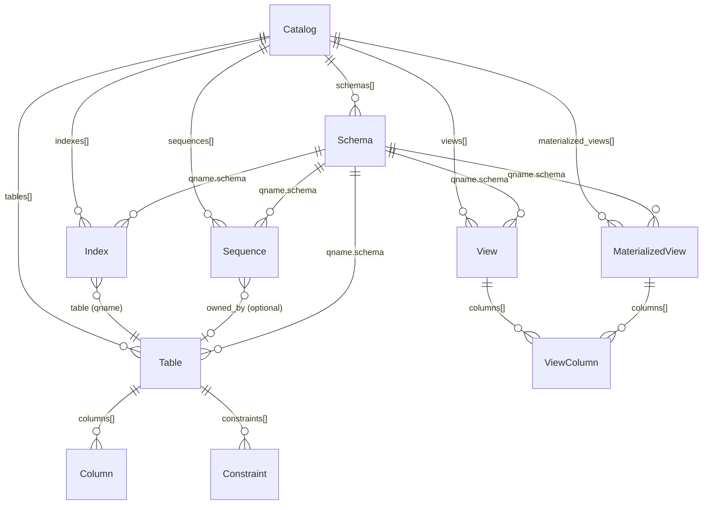

# IR

Deeper dive on the data model that everything diffs against. Source for
this doc lives in `crates/pgevolve-core/src/ir/`.

## Top-level shape

```rust
pub struct Catalog {
    pub schemas:            Vec<Schema>,
    pub tables:             Vec<Table>,
    pub indexes:            Vec<Index>,
    pub sequences:          Vec<Sequence>,
    pub views:              Vec<View>,
    pub materialized_views: Vec<MaterializedView>,
}
```

Four flat collections. No nesting (e.g., `Table::indexes`) for a
reason: indexes live in their own namespace within a schema and reference
their table by qname. Hierarchical nesting would have to maintain
referential integrity at every mutation; flat lists + name-based
references defer that to canonicalization time.

The implicit name-based relationships look like this:



## Canonicalization

`Catalog::canonicalize()`:

1. Sort each collection by canonical key (`schema.name`, then `qname`
   for tables/indexes/sequences).
2. Reject duplicates within a collection.

The output is **byte-stable**: identical inputs always produce identical
serialized output. This is what makes `PlanId` deterministic.

Failure modes:

- `IrError::InvalidIdentifier("duplicate schema: foo")` — two `Schema`s
  with the same name.
- Same for tables / indexes / sequences.

## `Identifier` and `QualifiedName`

`Identifier` is a single SQL identifier. Two constructors:

- `Identifier::from_unquoted(s)` — accepts `[a-z_][a-z0-9_$]*` shapes;
  rejects anything that would need quoting. This is what the parser
  and the user-facing config consume.
- `Identifier::from_quoted(s)` — accepts the body of a
  double-quoted identifier (with `""` → `"` already unescaped).

`render_sql()` returns the canonical SQL form, quoting only when
necessary. Two `Identifier`s compare equal iff their `as_str()`
representations match.

`QualifiedName { schema, name }` — schema-qualified `schema.name`.
Used wherever a top-level object name appears.

## `ColumnType`

The single most fact-laden type in the IR. `ColumnType` is the
**canonical** form of a Postgres column type:

```rust
pub enum ColumnType {
    Boolean,
    SmallInt, Integer, BigInt,
    Real, DoublePrecision,
    Numeric { precision: Option<u16>, scale: Option<i16> },
    Text, Varchar { len: Option<u32> }, Char { len: Option<u32> },
    Bytea,
    Date,
    Time { precision: Option<u8>, with_tz: bool },
    Timestamp { precision: Option<u8>, with_tz: bool },
    Interval { fields: Option<String>, precision: Option<u8> },
    Bit { len: u32, varying: bool },
    Uuid, Json, Jsonb,
    NetAddress(NetAddressKind),
    Array { element: Box<ColumnType>, dims: u8 },
    UserDefined(QualifiedName),
    Other { raw: String },
}
```

### Why the canonical form matters

PG accepts many spellings for the same type:

| Source spelling | Catalog form | Canonical IR |
|---|---|---|
| `int` | `integer` | `ColumnType::Integer` |
| `int4` | `integer` | `ColumnType::Integer` |
| `decimal` | `numeric` | `ColumnType::Numeric { .. }` |
| `bool` | `boolean` | `ColumnType::Boolean` |
| `timestamptz` | `timestamp with time zone` | `ColumnType::Timestamp { with_tz: true, .. }` |
| `varchar` (no length) | `character varying` (no length) | `ColumnType::Varchar { len: None }` |

`ColumnType::parse_from_pg_type_string` does the source-side and
catalog-side normalization to the same canonical form, so diff
operates on equality rather than on textual difference.

### `Other` and `UserDefined` — the escape hatches

- `Other { raw: String }` — types pgevolve doesn't recognize. Treated
  as opaque strings; two `Other`s match iff their raw strings match
  byte-for-byte. This lets the parser handle types it doesn't
  understand instead of aborting.
- `UserDefined(QualifiedName)` — qualified references to user-defined
  types (enums, domains, composites). v0.1 doesn't introspect their
  structure; v0.2 will.

## `DefaultExpr`

```rust
pub enum DefaultExpr {
    Literal(LiteralValue),
    Sequence(QualifiedName),
    Expr(NormalizedExpr),
}
```

- `Literal` — a typed literal (bool, integer, float, text, bytea,
  NULL).
- `Sequence` — detected from `nextval('schema.seq'::regclass)` or the
  bare `nextval('schema.seq')`. Both forms normalize to the same
  `QualifiedName`.
- `Expr(NormalizedExpr)` — any other expression, preserved as
  canonical text.

### `NormalizedExpr`

```rust
pub struct NormalizedExpr {
    pub canonical_text: String,
    pub ast_hash:       [u8; 32],
}
```

The canonical text is what you get after:

- Lowercasing keywords.
- Sorting operands of commutative operators (`a + b` ≡ `b + a`).
- Stripping redundant casts (`'foo'::text` → `'foo'` if the column is
  already `text`).
- Folding redundant parens.

Two `NormalizedExpr`s compare equal iff their `canonical_text`s match.
The `ast_hash` is a BLAKE3 hash of the canonical text, kept for fast
equality checks and as a stable identity for an expression.

### `NormalizedBody`

```rust
pub struct NormalizedBody {
    pub canonical_text: String,
    pub ast_hash:       [u8; 32],
}
```

`NormalizedBody` is the statement-scope counterpart to `NormalizedExpr`.
Where `NormalizedExpr` canonicalizes a single expression (e.g., a column
default or a CHECK predicate), `NormalizedBody` canonicalizes the body
of a body-bearing object — a view's `SELECT` statement, a function's
body, a trigger's action. The same canonicalization rules apply (keyword
case, redundant parens, etc.).

In v0.1 no objects carry a body; `NormalizedBody` is scaffolding for
v0.2 views and functions. It is kept in `pgevolve-core::parse::normalize_body`
so body-bearing objects added by v0.2 sub-specs can reuse the same
diffing semantics as `NormalizedExpr`.

## `Column` attributes

```rust
pub struct Column {
    pub name:      Identifier,
    pub ty:        ColumnType,
    pub nullable:  bool,
    pub default:   Option<DefaultExpr>,
    pub identity:  Option<Identity>,
    pub generated: Option<Generated>,
    pub collation: Option<QualifiedName>,
    pub comment:   Option<String>,
}
```

- `nullable = false` corresponds to `NOT NULL` — modeled as a
  column-level boolean rather than as a `Constraint` because it's
  significantly cheaper to diff.
- `identity` — `GENERATED ALWAYS / BY DEFAULT AS IDENTITY` with the
  backing sequence options.
- `generated` — `GENERATED ALWAYS AS (expr) STORED`. Postgres doesn't
  yet support `VIRTUAL`.
- `collation` — only the **explicit** collation; the catalog reader
  normalizes `pg_catalog.default` to `None` so it doesn't appear as
  drift on every text column.

## `Constraint`

```rust
pub struct Constraint {
    pub qname:      QualifiedName,
    pub kind:       ConstraintKind,
    pub deferrable: Deferrable,
    pub comment:    Option<String>,
}

pub enum ConstraintKind {
    PrimaryKey { columns: Vec<Identifier>, include: Vec<Identifier> },
    Unique     { columns: Vec<Identifier>, include: Vec<Identifier>, nulls_distinct: bool },
    ForeignKey(ForeignKey),
    Check      { expression: NormalizedExpr, no_inherit: bool },
}
```

Constraints are paired by `qname.name` (within a table) during diff.
Two constraints with the same name but different bodies diff as a
"replace" — pgevolve emits `DROP CONSTRAINT` + `ADD CONSTRAINT`.

## `Index`

```rust
pub struct Index {
    pub qname:              QualifiedName,
    pub table:              QualifiedName,
    pub method:             IndexMethod,
    pub columns:            Vec<IndexColumn>,
    pub include:            Vec<Identifier>,
    pub unique:             bool,
    pub nulls_not_distinct: bool,
    pub predicate:          Option<NormalizedExpr>,
    pub tablespace:         Option<Identifier>,
    pub comment:            Option<String>,
}
```

Indexes are first-class IR objects (paired by their own qname, not by
their backing table). This makes "rename the index" or "change the
opclass on column 2" a single-row diff entry.

## `View` and `MaterializedView`

Added in v0.2. Source: `crates/pgevolve-core/src/ir/view.rs`.

```rust
pub struct View {
    pub qname:              QualifiedName,
    pub columns:            Vec<ViewColumn>,
    pub body_canonical:     NormalizedBody,
    pub body_dependencies:  Vec<DepEdge>,
    pub security_barrier:   Option<bool>,
    pub security_invoker:   Option<bool>,
    pub comment:            Option<String>,
    // raw_body: parser-internal sentinel; not serialized.
}

pub struct MaterializedView {
    pub qname:              QualifiedName,
    pub columns:            Vec<ViewColumn>,
    pub body_canonical:     NormalizedBody,
    pub body_dependencies:  Vec<DepEdge>,
    pub comment:            Option<String>,
    // raw_body: parser-internal sentinel; not serialized.
}
```

### `body_canonical: NormalizedBody`

The canonicalized SELECT body. `NormalizedBody::from_sql` (in
`parse/normalize_body.rs`) feeds the raw SQL through `pg_query`'s
parse + deparse cycle and collapses whitespace. The same function is
called on the source side (T3/T4 parse pass) and the catalog side (T5
reader, which calls `pg_get_viewdef`). Because both sides go through
the same normalization, the differ compares canonical texts directly
without knowing anything about SQL semantics.

`canonical_hash` (BLAKE3 of the text, domain-separated with
`pgevolve-normalized-body-v1\n`) is kept for fast equality checks and
stable identity.

### `body_dependencies: Vec<DepEdge>`

Dependency edges extracted from the body AST by the T4 AST canonicalization
pass (`parse/ast_canon.rs`). Each `DepEdge` has:

```rust
pub struct DepEdge {
    pub from:   NodeId,         // NodeId::View or NodeId::Mv
    pub to:     NodeId,         // NodeId::Table, NodeId::View, or NodeId::Mv
    pub source: DepSource,      // DepSource::AstExtracted
}
```

`body_dependencies` is what makes the planner's dependent-recreation walk
possible (see `plan/recreate_views.rs`). It is also what the
`view-body-references-unmanaged-schema` lint rule checks.

## `ViewColumn`

```rust
pub struct ViewColumn {
    pub name:        Identifier,
    pub column_type: ColumnType,
    pub comment:     Option<String>,
}
```

A single named column in a view or materialized view. When constructed
from the source parser (T3), `column_type` is set to
`ColumnType::Other { raw: "unresolved" }` as a sentinel; the T4 AST
canonicalization pass fills in the resolved type. When built from the
live catalog (T5), `column_type` is parsed from
`format_type(a.atttypid, a.atttypmod)`.

## `UserType`

```rust
pub struct UserType {
    pub qname:   QualifiedName,
    pub kind:    UserTypeKind,
    pub comment: Option<String>,
}

pub enum UserTypeKind {
    Enum      { values:     Vec<EnumValue> },
    Domain    { base: ColumnType, nullable: bool, default: Option<NormalizedExpr>,
                check_constraints: Vec<DomainCheck>, collation: Option<QualifiedName> },
    Composite { attributes: Vec<CompositeAttribute> },
}
```

`UserType`s live in `Catalog::types: Vec<UserType>`, sorted by `qname` after
`canonicalize()`. Source lives in `crates/pgevolve-core/src/ir/user_type.rs`.

### `EnumValue`

```rust
pub struct EnumValue {
    pub name:       String,
    pub sort_order: f32,   // mirrors pg_enum.enumsortorder
}
```

`sort_order` is `f32` (matching Postgres's `real4`) to enable byte-stable
round-trip. `Eq` and `Hash` are implemented using the IEEE 754 bit pattern.

### `DomainCheck`

```rust
pub struct DomainCheck {
    pub name:       Identifier,
    pub expression: NormalizedExpr,
}
```

Domain defaults and CHECK expressions use `NormalizedExpr` — the same
canonicalized-text representation as column defaults and inline CHECK
constraints. Two `NormalizedExpr`s compare equal iff their `canonical_text`s
match, making domain diffs insensitive to whitespace and keyword case.

### `CompositeAttribute`

```rust
pub struct CompositeAttribute {
    pub name:      Identifier,
    pub ty:        ColumnType,
    pub collation: Option<QualifiedName>,
}
```

## `Function`

Added in v0.2. Source: `crates/pgevolve-core/src/ir/function.rs`.

```rust
pub struct Function {
    pub qname:                 QualifiedName,
    pub args:                  Vec<FunctionArg>,
    pub arg_types_normalized:  NormalizedArgTypes,
    pub return_type:           ReturnType,
    pub language:              FunctionLanguage,
    pub body:                  NormalizedBody,
    pub body_dependencies:     Vec<DepEdge>,
    pub volatility:            Volatility,
    pub strict:                bool,
    pub security:              SecurityMode,
    pub parallel:              ParallelSafety,
    pub leakproof:             bool,
    pub cost:                  Option<f32>,
    pub rows:                  Option<f32>,
    pub comment:               Option<String>,
}
```

`Function`s live in `Catalog::functions: Vec<Function>`, sorted by `(qname, arg_types_normalized)` after `canonicalize()`.

### Identity rule

Function identity is `(qname, arg_types_normalized)`. `arg_types_normalized` covers the IN/INOUT/VARIADIC args only (mirrors Postgres's `proargtypes`), enabling overloads with the same name but different input signatures to coexist.

`NormalizedArgTypes` stores the canonical type list and a BLAKE3 hash of the comma-joined type strings for fast equality and ordering.

### `body_dependencies: Vec<DepEdge>`

Dependency edges extracted from the body AST by the T4 body parser (`parse/builder/plpgsql.rs`):

- SQL bodies: extracted from `RangeVar` nodes in the SQL AST (schema-qualified references only).
- PL/pgSQL bodies: extracted from static embedded SQL statements (`PLpgSQL_stmt_execsql`). Dynamic SQL (`EXECUTE`) edges must be declared explicitly via `-- @pgevolve dep: schema.name` directives; undeclared `EXECUTE` sites fire the `plpgsql-dynamic-sql` lint rule.

`DepEdge.source` is `DepSource::AstExtracted` for parsed edges and `DepSource::AstDeclared` for directive edges.

## `Procedure`

Added in v0.2. Source: `crates/pgevolve-core/src/ir/procedure.rs`.

```rust
pub struct Procedure {
    pub qname:             QualifiedName,
    pub args:              Vec<FunctionArg>,
    pub language:          FunctionLanguage,
    pub body:              NormalizedBody,
    pub body_dependencies: Vec<DepEdge>,
    pub security:          SecurityMode,
    pub commits_in_body:   bool,
    pub comment:           Option<String>,
}
```

`Procedure`s live in `Catalog::procedures: Vec<Procedure>`, sorted by `qname` after `canonicalize()`.

### Identity rule

Procedure identity is `qname` only (no arg-type disambiguation). pgevolve v0.2 deliberately restricts procedures to a single definition per qualified name. This simplifies the plan-format and intent model; overloading can be added in a future sub-spec.

### `commits_in_body`

Set to `true` by the PL/pgSQL body parser when it detects `PLpgSQL_stmt_commit` or `PLpgSQL_stmt_rollback` nodes anywhere in the body AST (including inside `IF`, `LOOP`, etc.). The planner uses this flag to emit the step with `TransactionConstraint::OutsideTransaction`, since a procedure containing `COMMIT`/`ROLLBACK` cannot run inside an outer `BEGIN … COMMIT` block.

## `Sequence`

```rust
pub struct Sequence {
    pub qname:     QualifiedName,
    pub data_type: ColumnType,    // SmallInt / Integer / BigInt
    pub start:     i64,
    pub increment: i64,
    pub min_value: Option<i64>,   // None == PG type-default
    pub max_value: Option<i64>,
    pub cache:     i64,
    pub cycle:     bool,
    pub owned_by:  Option<SequenceOwner>,
    pub comment:   Option<String>,
}
```

The catalog reader normalizes PG's per-type defaults for `min_value` /
`max_value` to `None` (the same reasoning as collation normalization).

## What's deliberately not in the IR

- **`NOT VALID` constraints.** The IR represents only fully-validated
  constraints; `NOT VALID` is an intermediate planner artifact.
- **Auto-generated index names.** All indexes must be named in
  source. Constraint-backing indexes are tied to the constraint, not
  modeled as separate `Index`es.
- **Row data.** pgevolve never reads or writes table contents.
- **Cluster-level settings** (`postgresql.conf`, roles, tablespaces).
- **`pg_catalog` / `information_schema`** — unmanaged schemas don't
  appear in the IR.

## How the diff walks the IR

`Catalog::diff(other) -> Vec<Difference>`:

1. Pair-by-key over each top-level collection (`schemas`, `tables`,
   `indexes`, `sequences`).
2. For paired objects, recurse into nested collections (columns,
   constraints).
3. For each unmatched-on-the-left key, emit `present → removed`.
4. For each unmatched-on-the-right key, emit `missing → added`.
5. For each matched pair, recurse into the per-field diff.

The output `Vec<Difference>` is **flat**: every leaf change has a
slash-or-dot path like `tables.app.users.columns.email.nullable`. The
linter uses this for findings; the differ converts it into a
`ChangeSet` of higher-level `Change` enum variants.
