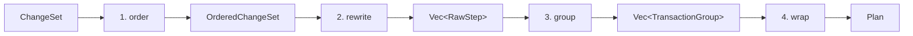

# Planner

The planner turns a `ChangeSet` into a flat, applyable
`Vec<TransactionGroup>`. Four sub-phases: **order → rewrite → group →
wrap**. Source lives in `crates/pgevolve-core/src/plan/`.



## Sub-phase 1: order

`order(target, source, changes) → OrderedChangeSet`.

The output is three buckets:

```rust
pub struct OrderedChangeSet {
    pub creates_and_adds: Vec<ChangeEntry>,
    pub modifies:         Vec<ChangeEntry>,
    pub drops:            Vec<ChangeEntry>,
    pub deferred_fks:     Vec<DeferredFkAdd>,
}
```

Each bucket is independently topologically sorted. The graph has the
edge sources from spec §6.4:

- `schema ← table ← default-using-sequence`
- `table ← index`
- `FK constraint ← both endpoints (owning + referenced)`
- `sequence ← owning table (OWNED BY)`

Creates and modifies use the **source-side** graph; drops use the
**target-side** graph (reversed, so dependents drop before what they
depend on).

### Determinism

The graph itself uses `BTreeMap` / `BTreeSet`. Kahn's algorithm with a
min-heap by `Ord` breaks ties: when multiple nodes are simultaneously
eligible, the smallest one (by `Ord` on `NodeId`) wins. Result: the
same `(target, source, changes)` triple always produces the same
ordered output.

### FK cycle extraction

Inline FKs in `CREATE TABLE` introduce a chicken-and-egg cycle when
table A FKs table B and B FKs A. The planner:

```mermaid
flowchart TD
    Start([order&#40;target, source, changes&#41;]) --> Topo1["topological sort"]
    Topo1 --> Cycle1{Cycle?}
    Cycle1 -- No --> Done([emit OrderedChangeSet])
    Cycle1 -- Yes --> Strip["strip FKs spanning cycle nodes<br/>(self-FKs exempt)"]
    Strip --> Topo2["topological sort (reduced)"]
    Topo2 --> Cycle2{Cycle?}
    Cycle2 -- No --> Defer["emit DeferredFkAdd entries"]
    Cycle2 -- Yes --> Fail([PlanError::UnbreakableCycle])
    Defer --> Done
```



1. Runs the topological sort.
2. On `Err(Cycle { nodes })`, walks `reduced = source` and removes every
   FK constraint whose owning + referenced tables are both in the
   cycle (self-referential FKs are exempt because they don't induce a
   graph cycle — the row insertion happens after the table exists).
3. Re-runs the topological sort on the reduced graph.
4. The extracted FKs become `DeferredFkAdd` entries — emitted as
   `ALTER TABLE ... ADD CONSTRAINT` steps after both tables are
   created.
5. If the second topo sort *also* cycles, returns
   `PlanError::UnbreakableCycle` with the rendered node names.

To avoid emitting the same FK twice (inline and deferred),
`strip_deferred_fks` removes the matching constraint from every
relevant `Change::CreateTable` body.

## Sub-phase 2: rewrite

`rewrite(ordered, target, policy) → Vec<RawStep>`.

Each top-level `Change` dispatches to an emitter that produces one or
more `RawStep`s. The bulk of this is straightforward SQL generation
(`pgevolve_core::plan::rewrite::sql`); the interesting bits are the
four online rewrites plus two drift-recovery variants.

### Drift-recovery changes

`read_catalog` now returns a `DriftReport` alongside the `Catalog`.
The diff stage folds these into the `ChangeSet` as two additional
`Change` variants:

**`Change::ValidateConstraint`** — emitted when the catalog contains a
NOT VALID constraint (left behind by an interrupted FK / CHECK NOT VALID
apply). The rewrite emits:

```sql
ALTER TABLE <schema>.<table> VALIDATE CONSTRAINT <name>;
```

This step is `InTransaction` and safe; it's equivalent to resuming the
second half of the FK NOT VALID + VALIDATE online rewrite.

**`Change::RecreateIndex`** — emitted when the catalog contains an
INVALID index (left behind by a failed `CREATE INDEX CONCURRENTLY`). The
rewrite emits:

```sql
DROP INDEX CONCURRENTLY IF EXISTS <schema>.<name>;
CREATE INDEX CONCURRENTLY <name> ON <schema>.<table> (...);
```

Both steps are `OutsideTransaction` (autocommit), consistent with the
normal concurrent-index handling.

### Online rewrite 1: `CREATE INDEX CONCURRENTLY` / `DROP INDEX CONCURRENTLY`

`plan::rewrite::concurrent_index::should_rewrite_create`:

```rust
policy.create_index_concurrent()
    && target.table_exists(&idx.table)
    && !idx.unique
```

Three gating conditions:

1. Policy enables the rewrite.
2. The target table already exists (i.e., is not being created in this
   plan — concurrent create on a brand-new table would be wasted
   transaction-isolation work).
3. The index is not `UNIQUE`. A failed `CREATE UNIQUE INDEX
   CONCURRENTLY` leaves an INVALID index that has to be cleaned up
   out-of-band; v0.1 plays it safe.

When all three hold, the rewrite emits the step with
`TransactionConstraint::OutsideTransaction`. `group_steps` then puts
it in its own non-transactional group. **`DROP INDEX`** mirrors:
`should_rewrite_drop` reads the index's uniqueness from the target
catalog (since the index doesn't exist on the source side), and emits
`DROP INDEX CONCURRENTLY` under the same conditions.

### Online rewrite 2 + 3: `NOT VALID` + `VALIDATE` (FK and CHECK)

`plan::rewrite::fk_not_valid_validate::should_rewrite`:

```rust
policy.fk_not_valid_then_validate()
    && matches!(c.kind, ConstraintKind::ForeignKey(_))
    && target.table_exists(qname)
```

Same three-condition shape. The rewrite emits **two** steps:

```rust
[
    RawStep { kind: AddConstraintNotValid, transactional: InTransaction, … },
    RawStep { kind: ValidateConstraint,    transactional: InTransaction, … },
]
```

Both steps are `InTransaction`, but they live in **separate
`TransactionGroup`s** at grouping time. That separation is the whole
point: step A (the cheap `NOT VALID` addition) commits independently
of step B (the expensive scan-the-table validation). If step B fails,
step A stays committed and the user re-plans only the validation.

How the separation happens: each `RawStep` is `InTransaction`, but
`group_steps` coalesces *only* adjacent steps that share their
`TransactionConstraint`. The grouping function doesn't currently split
adjacent `InTransaction` steps, so this is actually achieved by
**emitting** them with intervening steps that flip the constraint —
or by the executor's group boundary semantics treating each
`ValidateConstraint` as its own commit point.

> **Current implementation honesty.** As of v0.1, `mark_step_succeeded`
> commits the audit row inside the same transaction as the DDL. A
> later step's failure rolls back the entire group's DDL *and* the
> audit updates, then re-marks them outside the transaction. The
> NOT VALID / VALIDATE separation is structural in the plan (the
> directives say `group id=1` then `group id=2`) but the executor's
> per-group transaction boundaries are what actually commit step A
> before step B starts.

CHECK rewrite (`check_not_valid_validate.rs`) is the same shape, just
matching on `ConstraintKind::Check { .. }`.

### Online rewrite 4: SET NOT NULL via CHECK pattern

`plan::rewrite::set_not_null_check_pattern::should_rewrite`:

```rust
policy.not_null_via_check_pattern()
    && target.column_exists(qname, col)
```

When the column already exists in the target (i.e., this is "make an
existing column NOT NULL", not "add a brand-new NOT-NULL column"), the
rewrite emits **four** steps:

```sql
ADD CONSTRAINT __pgevolve_chk_<col> CHECK (<col> IS NOT NULL) NOT VALID;  -- step 1
VALIDATE CONSTRAINT __pgevolve_chk_<col>;                                   -- step 2
ALTER COLUMN <col> SET NOT NULL;                                            -- step 3 (cheap once 2 validated)
DROP CONSTRAINT __pgevolve_chk_<col>;                                       -- step 4
```

Steps 1, 2, and 4 are individually transactional but go in their own
groups so the user can observe progress. Step 3 is cheap (Postgres
uses the validated CHECK to skip the table scan), so it could ride
with step 4, but pgevolve keeps them as separate steps for clarity in
the audit log.

The synthesized `__pgevolve_chk_<col>` constraint name is reserved.
Users shouldn't create constraints with this prefix in their source.

### Atomic mode

`Strategy::Atomic` short-circuits **every** online rewrite — every
`should_rewrite_*` returns false. Output: one step per change, all
transactional, all in one group. The executor commits the whole thing
in a single `BEGIN/COMMIT` or fails atomically.

Useful for hermetic dev / test environments where you don't care about
locking and just want the apply to be a single atomic event.

## Sub-phase 3: group

`group_steps(steps) → Vec<TransactionGroup>`:

```rust
pub struct TransactionGroup {
    pub id:            u32,    // 1-indexed
    pub transactional: bool,
    pub steps:         Vec<RawStep>,
}
```

Adjacent steps with the same `TransactionConstraint` coalesce into one
group. Each transition flips a new group. Empty input produces an
empty output.

Example: 3 in-tx steps, then 1 out-of-tx step (concurrent index), then
2 in-tx steps → 3 groups (3 steps, 1 step, 2 steps).

## Sub-phase 4: wrap

`Plan::from_grouped(groups, source, target, target_identity, source_rev,
version, ruleset_version)`:

1. Walks every step in every group, assigning a contiguous 1-indexed
   `step_no` across all groups.
2. For each step where `destructive == true`, allocates the next
   `intent_id` and creates a `DestructiveIntent` row (id, step,
   kind, target, reason). The step gets its `intent_id` filled.
3. Computes `PlanId` over `(source, target, version,
   ruleset_version)`.
4. Captures `created_at` and the target snapshot.

Output: a `Plan` ready to write to disk.

### `PlanId` derivation

`PlanId::compute`:

```rust
let mut h = blake3::Hasher::new();
h.update(b"pgevolve-plan-id-v1\n");
h.update(pgevolve_version.as_bytes());
h.update(&[0]);
h.update(&planner_ruleset_version.to_be_bytes());
h.update(&[0]);
h.update(&bincode::serde::encode_to_vec(source, cfg)?);
h.update(&[0]);
h.update(&bincode::serde::encode_to_vec(target, cfg)?);
PlanId(*h.finalize().as_bytes())
```

Bincode is used because its encoding is byte-stable across runs and
across machines. The domain-separator prefix prevents accidental
cross-protocol collision with other BLAKE3 uses in the codebase.

## What's tested

| Property | Test |
|---|---|
| Topological order is deterministic | `graph::tests::deterministic_under_insertion_order_changes` |
| Linear chain produces dependency-correct creates | `ordering::tests::linear_schema_table_index_orders_in_dependency_order` |
| FK between independent tables orders referenced first | `ordering::tests::fk_between_independent_tables_orders_referenced_first` |
| Two-table FK cycle extracts at least one FK | `ordering::tests::two_table_fk_cycle_extracts_one_or_more_fks` |
| Three-way FK cycle breaks at least one | `ordering::tests::three_way_fk_cycle_breaks_at_least_one` |
| Self-referential FK doesn't cycle | `edges::tests::self_referential_fk_does_not_cycle` |
| Concurrent index rewrite gates correctly | `rewrite::tests::create_index_on_existing_table_rewrites_to_concurrent`, `unique_create_index_does_not_rewrite_to_concurrent`, etc. |
| FK / CHECK NOT VALID rewrite gates | `add_fk_on_existing_table_emits_two_steps`, `add_check_on_existing_table_emits_two_steps` |
| SET NOT NULL pattern gates | `set_not_null_on_existing_column_emits_four_steps`, `set_not_null_with_atomic_policy_stays_single_step` |
| `group_steps` partitions on transactional boundary | `grouping::tests::transition_creates_new_group` |
| `PlanId` deterministic across runs | `plan_id_is_deterministic_across_calls`, plus tier-5 property test |
| Drop graph runs in reverse dependency order | `ordering::tests::drops_run_in_reverse_dependency_order` |
| Deferred FKs are stripped from inline CREATE TABLE | indirectly via `two_table_fk_cycle_extracts_one_or_more_fks` (asserts remaining + deferred FKs == 2) |

## What's currently incomplete

- **Column reorder.** The diff detects column position drift
  (`columns.<order>` paths) but the planner doesn't emit a reorder
  step. Postgres has no `ALTER COLUMN ... POSITION`, so this would
  require a table rewrite. As of v0.2 readiness, this is surfaced as a
  `Severity::LintAtPlan` finding (`column-position-drift`) rather than
  being silently ignored. `pgevolve plan` exits `2` on an unwaived
  finding; waive with `[[lint_waiver]]` + a separate `rewrite-table`
  invocation (implementation pending v0.2 sub-spec).
- **The `ALTER TYPE ... ADD VALUE` enum rewrite.** Lands with enum
  support (v0.2). Adding an enum value can't run in a transaction (in
  PG ≤ 11) or has restrictions (≥ 12); the rewrite will mirror the
  `CONCURRENTLY` group-by-group story.
- **Online column-type change** (e.g., `int → bigint`). The planner
  currently emits a single `ALTER COLUMN ... TYPE` step which can
  rewrite the entire table. A future rewrite will use the
  "shadow column + USING expression + rename" pattern.
